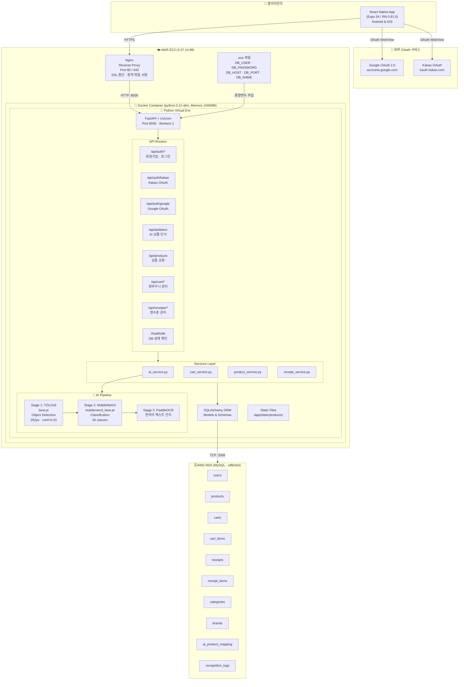
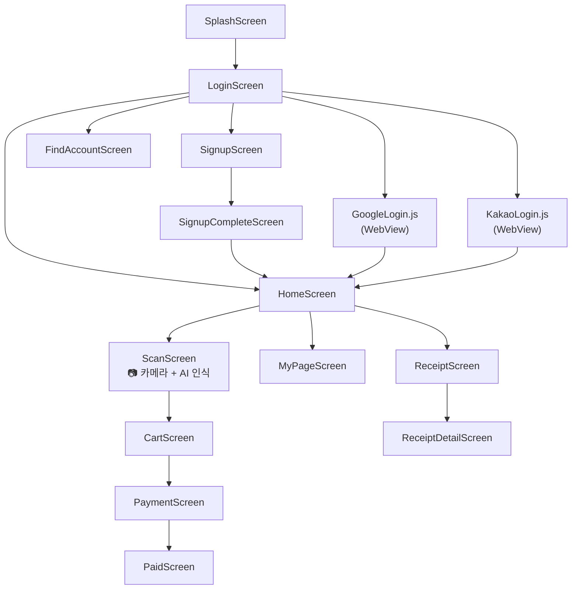
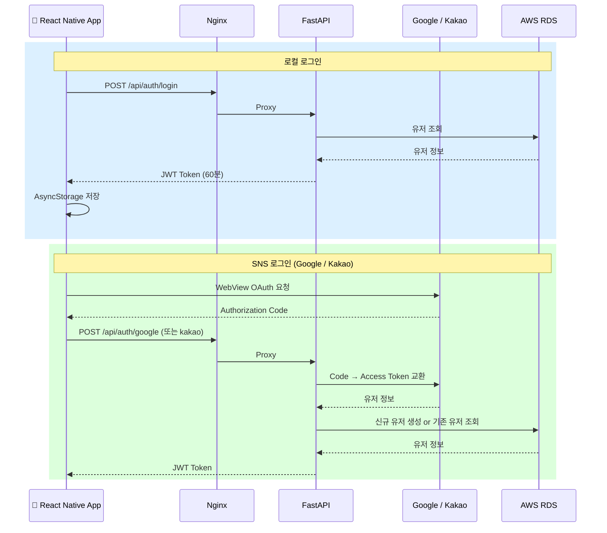
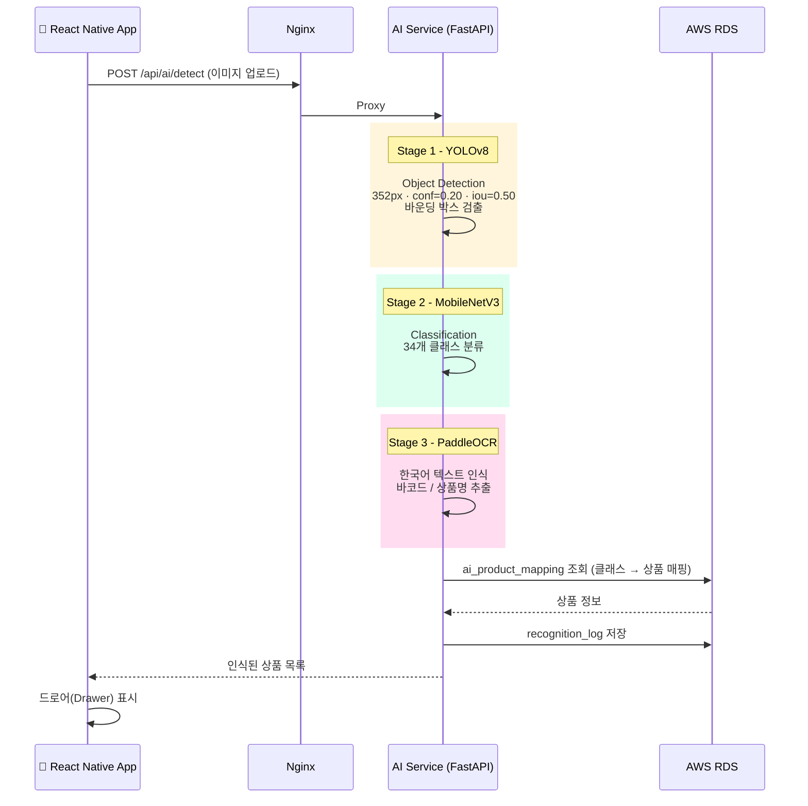
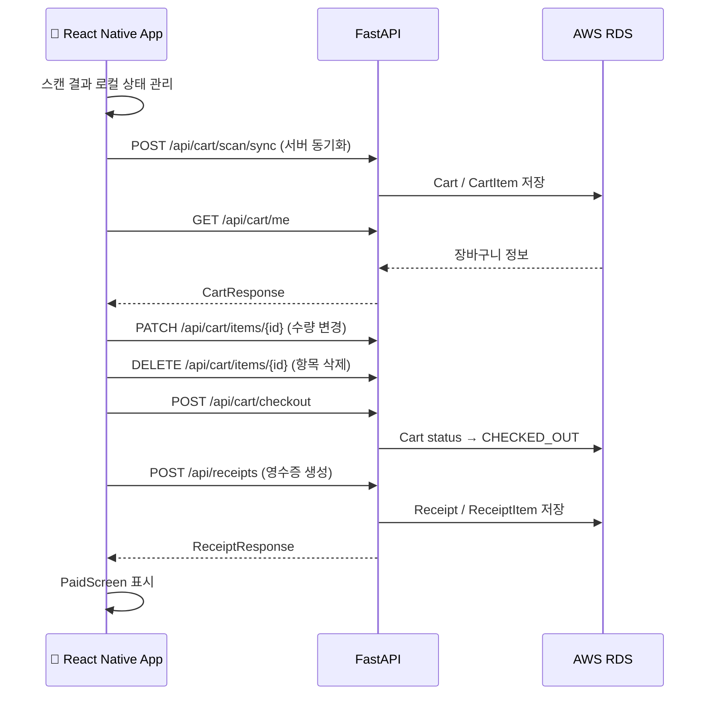
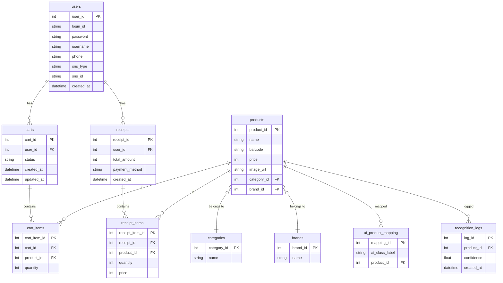

# AI 기반 스마트 상품 스캔 앱
## AI · 딥러닝 시스템 아키텍처 및 기술 설계 문서

---

## 1. 프로젝트 개요

본 프로젝트는 사용자가 마트에서 상품을 하나 집어 스마트폰 앱으로 촬영하면,
AI가 자동으로 상품을 인식하고 장바구니에 추가하는 **AI 기반 스마트 상품 스캔 애플리케이션**을 구현하는 것을 목표로 한다.

본 프로젝트는 완전 무인매장이나 도난 방지를 목표로 하지 않으며,
학생 팀이 현실적으로 구현 가능한 수준의 **2단계 AI 인식 시스템**을 중심으로 설계되었다.

---

## 2. 전체 시스템 구조 개요

본 시스템은 **YOLO 기반 객체 탐지 모델**과
**추가 딥러닝 분류 모델**을 결합한 2-stage 구조로 구성된다.

```text
[모바일 앱]
   ↓ (이미지 촬영)
[FastAPI 서버]
   ↓
[YOLOv8 객체 탐지] + ocr , mobile  
   ↓
[상품 영역 Crop]
   ↓
[추가 딥러닝 분류 모델]
   ↓
[최종 상품 결정]
   ↓
[MySQL 장바구니 저장]
```


```
mobilenet - 
yolo 객체 탐지 - mobilenet 추론 - +(OCR 판단)

객체 탐지(단일모델) - 추론 OCR ml, 상표

정확한 이미지 촬영 유도
텍스트 블럭 찾아내게 해서 OCR로 - 이런 경우 재 라벨링

글자 인식 관건

단일 모델 + OCR 유도
후 리스트

상용화 시 고도화로.

프로세스가 말이 되게

객체 탐지 후 리스트에서 선택이라도 하게

텍스트 인식 모델 + 객체 탐지 모델

전체 뼈대 구현 우선 - 안되더라도 진행

ppt - system flowchart 추가 꼭 꼬꼬 꼮꼮 (일반인에게 이해 시키기)
일반인에게 판매 목적처럼

발표자료 - 개발일지 WBS
```

상용화시 제품 학습에 대한 어려움 - 수십만개의 제품. (사업화 시 개선사항으로 추가 해야함) - OCR로 텍스트 읽고 하던지 나중에 큰 사업이    될시에 개선사항을 생각해야함 - 미래 방향성 - 당장이 아닌 사업화 

gpt api


## 3. 전체 아키텍쳐 구조




---

## 모바일 앱 화면 구조



---

### 인증 흐름



---

### AI 인식 파이프라인



---

### 장바구니 & 결제 흐름



---

### 데이터베이스 ERD



---

### 인프라 구성 요약

| 구성 요소 | 기술 스택 | 비고 |
|-----------|-----------|------|
| 모바일 앱 | React Native 0.81.5 / Expo 54 | Android + iOS |
| 리버스 프록시 | Nginx | SSL 종단, 정적 파일 서빙 |
| 백엔드 API | FastAPI + Uvicorn | Port 8000 |
| 컨테이너 | Docker (python:3.12-slim) | 메모리 1500MB 제한 |
| 가상환경 | Python venv (Docker 레이어 내) | requirements.txt 기반 |
| 데이터베이스 | AWS RDS MySQL | utf8mb4, pool_recycle=1800s |
| AI 모델 | YOLOv8 + MobileNetV3 + PaddleOCR | 컨테이너 내 로컬 저장 |
| 인증 | JWT (HS256, 60분) | python-jose |
| OAuth | Google OAuth 2.0 + Kakao OAuth | WebView 방식 |
| 호스팅 | AWS EC2 (3.37.14.89) | 단일 서버 |
| 환경변수 | .env 파일 | DB 접속 정보 (git 제외) |

### 포트 매핑

```
Internet :80/:443 → Nginx → Docker :8000 (FastAPI) → AWS RDS :3306 (MySQL)
```

